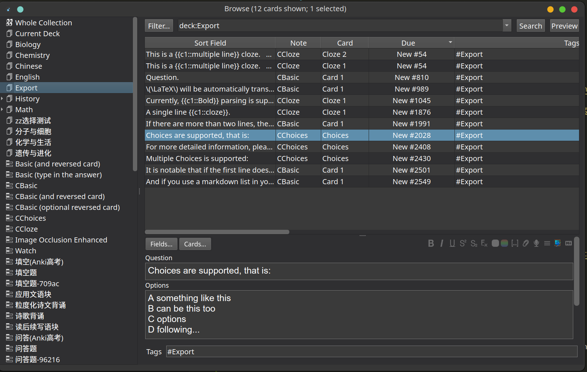
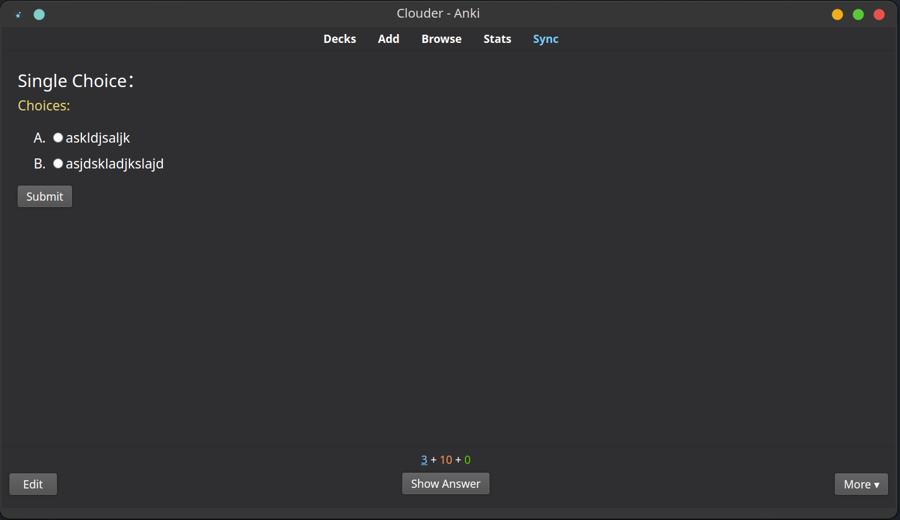

# AnkiLink

[![Release][release-shield]][release-url]
[![MIT License][license-shield]][license-url]
[![Issues][issues-shield]][issues-url]
[![Stargazers][stars-shield]][stars-url]
[![Forks][forks-shield]][forks-url]
[![Contributors][contributors-shield]][contributors-url]
[![CodeFactor][codefactor-shield]][codefactor-url]

查看 [AnkiLink 项目](https://github.com/users/Clouder0/projects/1) 了解未来计划。

## Introduction

**注意：该工具面向用户，如果你是开发者，请访问[AnkiIn](https://github.com/Clouder0/AnkiIn).**

AnkiLink 能将你的 markdown 语法文本导入到 Anki 中。  
简单而强大的小工具。

导入 Anki 的轮子已经被造了一车了，但 AnkiLink 能让你耳目一新。  
遵循极简主义，AnkiLink 采用自然语法，让你在流畅书写卡片的同时，免于纠结排版格式的问题。

特色：

- 通过 AnkiConnect 直接导入 Anki
- 导出为 `apkg` 文件，无需打开 Anki
- 可读性佳的语法
- 支持 Markdown 渲染
- 支持 Html 语法
- 跨平台
- 发布二进制文件，免于安装 Python 环境
- 常用的内置 Note 类型
  - 问答
  - 完形填空
  - 选择题(单选、多选)
  - 列表完形填空
  - 表格完形填空
- 易于拓展

---

使用这个工具，你无需牺牲原文档的可读性，就能与 Anki 对接。

这里是一个小例子：

```markdown
问题。  
答案。

一行问题。  
多行答案。  
第一行会被识别为问题。

如果需要多行问题，可以考虑 <br> 这样换行。
可能有点过于极客了，可读性也不是很好。

渲染 Markdown.
- 列表
    - 之类的东西

创建完形填空**只需要加粗**就可以**了**，有点像是**划重点**。
```

## 安装

### 安装 AnkiConnect

安装 [AnkiConnect](https://github.com/FooSoft/anki-connect) 拓展.  
Code:`2055492159`  
详细流程见 [anki-connect repo](https://github.com/FooSoft/anki-connect).

### 安装 Python

安装最新版的 Python.

如果用二进制版本，跳过此步。

### 下载脚本

方法一（不推荐）：直接下载本仓库的 `src` 文件夹。随后执行 `pip install -r src/requirements.txt` 补全依赖。

方法二（推荐）：在 [Releases](https://github.com/Clouder0/AnkiLink/release) 中下载二进制版本，不需要 Python 环境，开箱即用。

### 导入测试牌组

这一步的意义在于，将几个内置的 Note 类型导入到 Anki 中。  

它会创建一个名为 `Export` 的牌组，还有一个名为 `#Export` 的标签。  
所有导入的卡片默认都会进入 `Export` 牌组中，加上 `#Export` 的标签。随后你可以在 Anki 中批量更改它们。

通过命令行参数，你可以指定导入的卡片所属的牌组、标签。例如： `./AnkiLink test.md --tags tag1 tag2 --deck targetDeck`

[下载测试牌组](https://github.com/Clouder0/AnkiLink/blob/main/tests/ExampleDeck.apkg) 并导入。

大概长这样：


现在安装完成了。

## 使用方法

这是一个命令行工具。

Windows 系统下, 打开 `cmd` 或者任意你喜欢的终端，执行:  
`{yourpath}\AnkiLink.exe {yourfile}`  
如果用源码，执行：
`python -m {yourpath}\src {yourfile}`  

其余平台同理。

更多用法, 输入 `.\AnkiLink -h` 之类的东西查看。

### 导出为 apkg 文件

如果你想导出为 apkg 文件，使用 `-o filename` 参数。

例如从 `test2.md` 生成 `test.apkg`，输入:  

```bash
python -m src tests/test2.md -o test.apkg
```

## 笔记结构

被导入的笔记必须遵从一定的语法结构，才能被脚本识别。

一个「块」被识别为一个笔记，块是用两个换行符分割的内容块，下面有个例子帮助你更好地理解：

值得注意的是，Html 语法是支持的。

```markdown
这是一个块。

这是一个  
多行的块

这也是一个**块**
```

### 笔记类型

#### 问答

Anki 中最基础的类型。
两行及以上的块，如果没有被识别为别的类型，最终会被识别为问答类型。

```markdown
Question.
Answer.
```

#### 完形填空

另一个基础类型。
任何块中，第一行含有 `**加粗文本**` 就会被识别为完形填空。

```markdown
This is a **Cloze**.

This is another **Cloze**  
with more than one **line**.

This is not a Cloze.
But rather a **Q&A**.
```

#### 选择题

选 A 还是选 B...这是个问题。




这不是 Anki 内置的类型，但因为比较常用，被内置在本项目中。
我导入了一个 [Monokaicloze](https://github.com/ecator/anki-theme-monokaicloze-radios) 的修改版本来实现这个功能。

任何块，如果第二行以 `A` 开头，就会被识别为一个选择题。

```markdown
Question:
A Option1
B Option2
C Option3
A
一些额外信息，类似于 Back Extra.

Question:
A Option1
B Option2
C Option3
AB

I just want a simple Q&A.
 A simple Q&A. Use space to avoid being recognized as Choices.
可以在第二行加一个空格来避免被识别为选择题。
```

#### 列表完形填空

列表会被识别为完形填空。

```markdown

- List Cloze
  - Cloze **as** a list
  - no need to contain a cloze in the first line
      - pretty **handy**
      - but remember this may make a card huge!

Example List QA
- A list, or an outlined format, are now supported.
  - SHJKD
  - lksfdhos
  - sdhfksaj
      - dskf
      - sdkf
          - dfjs
          - dfjs
  - oipw3
  - dppp
```

#### 表格完形填空

表格也会被识别为完形填空。

```markdown
Table is now supported too.
| Syntax      | Description | Test Text     |
| :---        |    :----:   |          ---: |
| Header      | Title       | Here's this   |
| Paragraph   | Text        | And more      |
A funny feature.

| Table      | Cloze | is also supported |
| :---        |    :----:   |          ---: |
| H**e**ader      | Title       | Here's this   |
| Parag**ra**ph   | Text        | And more      |
```

---

更多例子, 见 [tests](https://github.com/Clouder0/AnkiLink/tree/main/tests).

## Credit

- [AnkiIn](https://github.com/Clouder0/AnkiIn)
- [anki](https://github.com/ankitects/anki)
- [anki-connect](https://github.com/FooSoft/anki-connect)
- [genanki](https://github.com/kerrickstaley/genanki)
- [markdown2](https://github.com/trentm/python-markdown2)

## License

采用 GPL v3 协议开源。
License is available [here](https://github.com/Clouder0/AnkiLink/blob/main/LICENSE).

[contributors-shield]: https://img.shields.io/github/contributors/Clouder0/AnkiLink.svg
[contributors-url]: https://github.com/Clouder0/AnkiLink/graphs/contributors
[forks-shield]: https://img.shields.io/github/forks/Clouder0/AnkiLink.svg
[forks-url]: https://github.com/Clouder0/AnkiLink/network/members
[stars-shield]: https://img.shields.io/github/stars/Clouder0/AnkiLink.svg
[stars-url]: https://github.com/Clouder0/AnkiLink/stargazers
[issues-shield]: https://img.shields.io/github/issues/Clouder0/AnkiLink.svg
[issues-url]: https://github.com/Clouder0/AnkiLink/issues
[license-shield]: https://img.shields.io/github/license/Clouder0/AnkiLink.svg
[license-url]: https://github.com/Clouder0/AnkiLink/blob/main/LICENSE
[release-shield]: https://img.shields.io/github/release/Clouder0/AnkiLink.svg
[release-url]: https://github.com/Clouder0/AnkiLink/releases
[codefactor-shield]: https://www.codefactor.io/repository/github/clouder0/AnkiLink/badge/main
[codefactor-url]: https://www.codefactor.io/repository/github/clouder0/AnkiLink/overview/main
